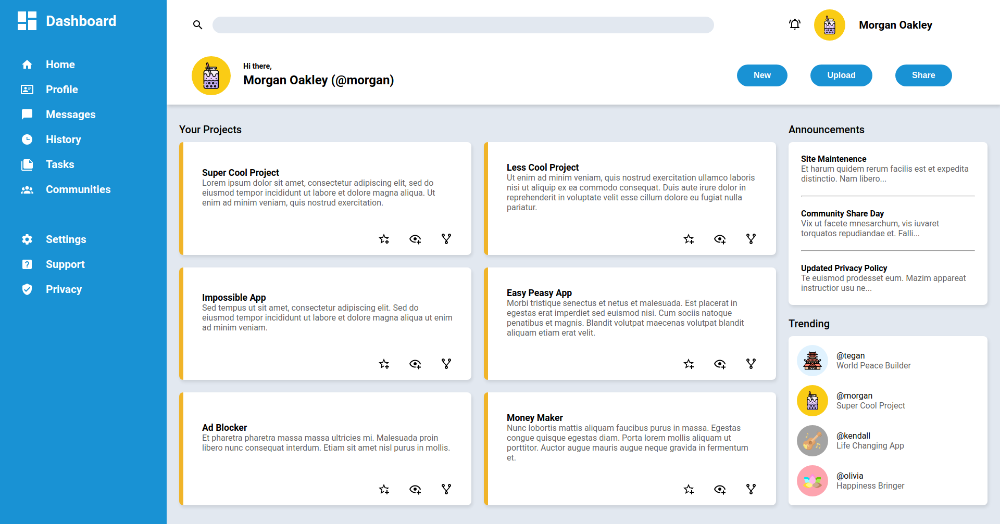

# js-admin-dash
A webpage front-end implementation of an admin dashboard 

[Live Demo](https://sorrrb.github.io/js-admin-dash/)

## Demo Preview

### Changelog
6/23/2022 12:51 - complete initial iteration of dashboard 

### Languages
- HTML
- CSS

### Concepts
- CSS Grid
- CSS Functions
- Dynamic Page Layout

## Attribution(s)
Bubble-tea icons created by [Freepik](https://www.flaticon.com/authors/freepik) - Flaticon
Ukulele icons created by [Icongeek26](https://www.flaticon.com/authors/Icongeek26) - Flaticon
Cultures icons created by [Eucalyp](https://www.flaticon.com/authors/Eucalyp) - Flaticon
Chakras icons created by [torskaya](https://www.flaticon.com/authors/torskaya) - Flaticon

#### To-Do
- Icon hover states
- Replace project dummy content
- Refactor content grid logic